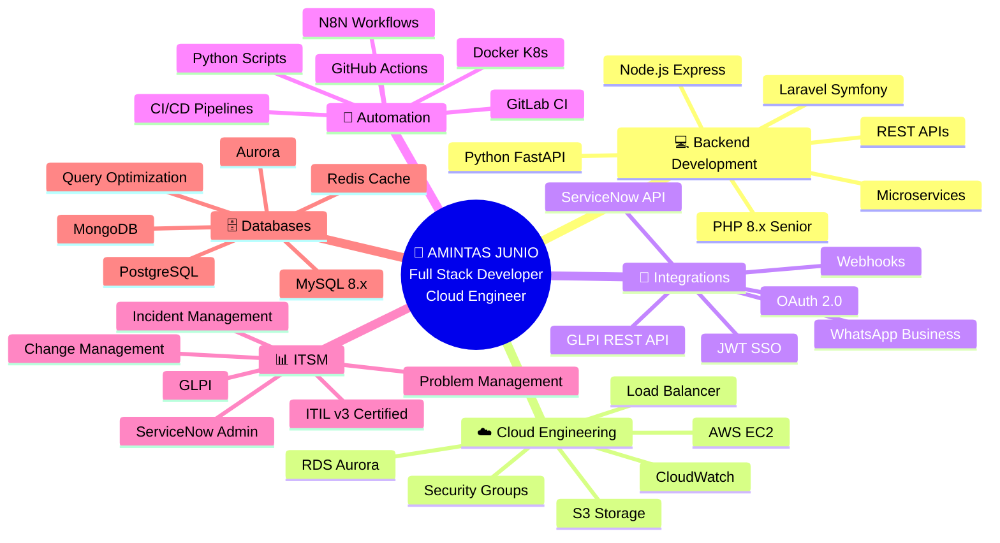

<div align="center">
  
</div>

<h3 align="center">
  
</h3>

<div align="center">
  
</div>

<br>


## 💫 Sobre Mim

👨‍💻 **Desenvolvedor de Software Web | Cloud Engineer** @ **Donuts Tech**

🎯 Especialista em **PHP**, **AWS** e **Integrações Complexas**

🔧 Desenvolvendo o produto **Interact Play**

🌐 Apaixonado por **Automação**, **APIs** e **Cloud Computing**

📍 Montes Claros - MG, Brasil

<br><br><br>

## 🛠️ Minha Caixa de Ferramentas

<div align="center">

### 💻 Linguagens & Frameworks

<p>
  
  
  
  
  
  
  
  
</p>

### 🗄️ Databases & Storage

<p>
  
  
  
  
  
</p>

### ☁️ Cloud & Infrastructure

<p>
  
  
  
  
  
  
  
  
  
</p>

### 🔌 Integration & Automation

<p>
  
  
  
  
  
  
</p>

### 🛠️ Tools & DevOps

<p>
  
  
  
  
  
  
  
  
</p>

### 📊 ITSM & Support

<p>
  
  
  
  
</p>

</div>

<br>

## 💼 Experiência Profissional

<table>
<tr>
<td width="50%" valign="top">

### 🎯 Donuts Tech
**Desenvolvedor de Software Web | Cloud Engineer**  
*Janeiro 2025 - Presente*

✨ **Principais Realizações:**
- 🎮 Desenvolvimento e arquitetura do **Interact Play**
- ☁️ Migração e otimização de infraestrutura AWS
- 🔐 Implementação de Security Groups e políticas IAM
- 📱 Solução completa de automação WhatsApp Business
- 🔄 Integrações REST API com ServiceNow
- 📊 Redução de 40% nos custos de infraestrutura
- 🚀 Aumento de 60% na performance das aplicações

**Stack Principal:**  
`PHP 8.x` `AWS` `Docker` `MySQL` `JavaScript` `N8N`

</td>
<td width="50%" valign="top">

### 🔧 Projetos Destacados

**🏢 Sistema de Inventário Corporativo**
- Full Stack: PHP + MySQL + Bootstrap
- Controle completo de almoxarifado
- Dashboard analytics em tempo real

**📞 Integração C3 + GLPI**
- Automação de tickets via telefonia
- Redução de 70% no tempo de atendimento
- REST API + Webhooks

**🔌 ServiceNow Custom Solutions**
- Integrações personalizadas REST API
- Scripts de automação de workflows
- Sincronização multi-sistemas

**💬 Automação WhatsApp Business**
- Sistema de envio massivo inteligente
- Integração com CRM
- Controle de filas e agendamentos

</td>
</tr>
</table>

<br>

## 🎯 Áreas de Expertise

<div align="center">



</div>

<br>

<div align="center">

### 🎯 Habilidades Técnicas Detalhadas

</div>

<details open>
<summary><h2 align="center">💻 Backend Development - EXPERT (95%)</h2></summary>

<div align="center">


### 🚀 Principais Competências

**🔹 PHP Senior** - Desenvolvimento de aplicações web robustas e escaláveis  
**🔹 Node.js** - APIs REST de alta performance  
**🔹 Python** - Microservices e automação  
**🔹 Arquitetura** - Design patterns, SOLID, Clean Code  

### 📦 Frameworks & Ferramentas
`Laravel` `Symfony` `CodeIgniter` `Express.js` `FastAPI` `Composer` `NPM`

</div>

</details>

<details open>
<summary><h2 align="center">☁️ Cloud Engineering - ADVANCED (85%)</h2></summary>

<div align="center">


### ⚡ Amazon Web Services

**🔹 EC2** - Provisionamento, auto-scaling e gerenciamento de instâncias  
**🔹 S3** - Object storage, versionamento e políticas de bucket  
**🔹 RDS & Aurora** - Databases gerenciados com alta disponibilidade  
**🔹 Segurança** - Security Groups, IAM Policies, VPC  

### 🛠️ DevOps & Infrastructure
`Terraform` `CloudFormation` `VPC` `Load Balancer` `Route 53` `CloudWatch`

</div>

</details>

<details open>
<summary><h2 align="center">🔌 Integrations & APIs - EXPERT (98%)</h2></summary>

<div align="center">


### 🔗 Integrações Desenvolvidas

**🔹 ServiceNow REST API** - Automação de workflows ITSM e sincronização de dados  
**🔹 WhatsApp Business API** - Sistema de mensageria corporativa massiva  
**🔹 GLPI API** - Integração com sistemas de tickets e inventário  
**🔹 Webhooks** - Event-driven architecture e real-time data  

### 🌐 Protocolos & Padrões
`REST` `SOAP` `GraphQL` `WebSockets` `JWT` `OAuth 2.0` `API Gateway`

</div>

</details>

<details open>
<summary><h2 align="center">🤖 Automation & DevOps - ADVANCED (80%)</h2></summary>

<div align="center">


### ⚙️ Ferramentas de Automação

**🔹 N8N** - Workflows de automação no-code/low-code  
**🔹 CI/CD** - Pipelines automatizados com GitLab CI e GitHub Actions  
**🔹 Docker** - Containerização de aplicações e orquestração  
**🔹 Scripts** - Automação de processos com Python e JavaScript  

### 🚀 Práticas DevOps
`Git Flow` `Blue-Green Deploy` `Rolling Updates` `Infrastructure as Code` `Monitoring`

</div>

</details>

<details open>
<summary><h2 align="center">📊 ITSM & Service Management - EXPERT (90%)</h2></summary>

<div align="center">


### 🎯 Gestão de Serviços

**🔹 ServiceNow** - Administration, Development e customizações  
**🔹 GLPI** - Help desk, inventário e gestão de ativos  
**🔹 ITIL v3** - Framework de boas práticas certificado  
**🔹 Processos** - Incident, Problem, Change e Request Management  

### 📋 Expertise ITIL
`Service Desk` `Problem Management` `SLA Management` `CMDB` `Knowledge Base`

</div>

</details>

<details open>
<summary><h2 align="center">🗄️ Databases & Storage - ADVANCED (88%)</h2></summary>

<div align="center">


### 💾 Gerenciamento de Dados

**🔹 MySQL 8.x** - Otimização, indexação e performance tuning  
**🔹 PostgreSQL** - Queries complexas, procedures e triggers  
**🔹 Amazon Aurora** - Databases em cloud com alta disponibilidade  
**🔹 MongoDB** - NoSQL, big data e documentos JSON  

### 🔧 Skills Avançadas
`Query Optimization` `Indexing Strategies` `Replication` `Backup & Recovery` `Sharding`

</div>

</details>

<br>

<div align="center">

### 🛠️ Stack Tecnológica Completa


</div>

<br>

<div align="center">

### 📊 Radar de Competências


</div>

<br>

## 🔌 Exemplos de Código

<details>
<summary><b>🔷 ServiceNow REST API - Criar Incident</b></summary>

```javascript
/**
 * Cria um incident no ServiceNow via REST API
 * @param {Object} incidentData - Dados do incident
 * @returns {Promise<Object>} - Resposta da API
 */
async function createServiceNowIncident(incidentData) {
  const instance = 'https://dev12345.service-now.com';
  const endpoint = '/api/now/table/incident';
  
  const response = await fetch(instance + endpoint, {
    method: 'POST',
    headers: {
      'Content-Type': 'application/json',
      'Authorization': 'Basic ' + btoa(username + ':' + password)
    },
    body: JSON.stringify({
      short_description: incidentData.description,
      urgency: incidentData.urgency,
      priority: incidentData.priority,
      category: incidentData.category,
      assigned_to: incidentData.assignee,
      caller_id: incidentData.caller
    })
  });
  
  const result = await response.json();
  console.log('Incident criado:', result.result.number);
  return result;
}
```

</details>

<details>
<summary><b>🔷 WhatsApp Business API - Envio de Mensagem</b></summary>

```php
<?php
/**
 * Classe para integração com WhatsApp Business API
 */
class WhatsAppBusinessAPI {
    private $apiUrl;
    private $token;
    private $phoneNumberId;
    
    public function __construct($token, $phoneNumberId) {
        $this->apiUrl = "https://graph.facebook.com/v18.0";
        $this->token = $token;
        $this->phoneNumberId = $phoneNumberId;
    }
    
    /**
     * Envia mensagem de texto
     */
    public function sendTextMessage($to, $message) {
        $data = [
            'messaging_product' => 'whatsapp',
            'recipient_type' => 'individual',
            'to' => $to,
            'type' => 'text',
            'text' => [
                'preview_url' => false,
                'body' => $message
            ]
        ];
        
        return $this->makeRequest('POST', "/{$this->phoneNumberId}/messages", $data);
    }
    
    /**
     * Envia mensagem com template
     */
    public function sendTemplateMessage($to, $templateName, $parameters = []) {
        $data = [
            'messaging_product' => 'whatsapp',
            'to' => $to,
            'type' => 'template',
            'template' => [
                'name' => $templateName,
                'language' => ['code' => 'pt_BR'],
                'components' => [
                    [
                        'type' => 'body',
                        'parameters' => $parameters
                    ]
                ]
            ]
        ];
        
        return $this->makeRequest('POST', "/{$this->phoneNumberId}/messages", $data);
    }
    
    private function makeRequest($method, $endpoint, $data = null) {
        $ch = curl_init($this->apiUrl . $endpoint);
        curl_setopt_array($ch, [
            CURLOPT_RETURNTRANSFER => true,
            CURLOPT_CUSTOMREQUEST => $method,
            CURLOPT_HTTPHEADER => [
                'Authorization: Bearer ' . $this->token,
                'Content-Type: application/json'
            ],
            CURLOPT_POSTFIELDS => json_encode($data)
        ]);
        
        $response = curl_exec($ch);
        $httpCode = curl_getinfo($ch, CURLINFO_HTTP_CODE);
        curl_close($ch);
        
        return [
            'code' => $httpCode,
            'response' => json_decode($response, true)
        ];
    }
}

// Exemplo de uso
$whatsapp = new WhatsAppBusinessAPI($token, $phoneNumberId);
$whatsapp->sendTextMessage('5538999999999', 'Olá! Mensagem automática do sistema.');
?>
```

</details>

<details>
<summary><b>🔷 AWS S3 - Upload e Gestão de Arquivos</b></summary>

```php
<?php
require 'vendor/autoload.php';

use Aws\S3\S3Client;
use Aws\Exception\AwsException;

/**
 * Classe para gerenciar arquivos no AWS S3
 */
class S3FileManager {
    private $s3Client;
    private $bucket;
    
    public function __construct($region, $bucket) {
        $this->bucket = $bucket;
        $this->s3Client = new S3Client([
            'region' => $region,
            'version' => 'latest'
        ]);
    }
    
    /**
     * Upload de arquivo para S3
     */
    public function uploadFile($filePath, $key, $acl = 'private') {
        try {
            $result = $this->s3Client->putObject([
                'Bucket' => $this->bucket,
                'Key' => $key,
                'SourceFile' => $filePath,
                'ACL' => $acl,
                'StorageClass' => 'STANDARD_IA',
                'Metadata' => [
                    'uploaded-by' => 'system',
                    'upload-date' => date('Y-m-d H:i:s')
                ]
            ]);
            
            return [
                'success' => true,
                'url' => $result['ObjectURL'],
                'etag' => $result['ETag']
            ];
        } catch (AwsException $e) {
            return [
                'success' => false,
                'error' => $e->getMessage()
            ];
        }
    }
    
    /**
     * Gera URL pré-assinada para download
     */
    public function getPresignedUrl($key, $expires = '+20 minutes') {
        $cmd = $this->s3Client->getCommand('GetObject', [
            'Bucket' => $this->bucket,
            'Key' => $key
        ]);
        
        $request = $this->s3Client->createPresignedRequest($cmd, $expires);
        return (string) $request->getUri();
    }
}
?>
```

</details>

<br>

## 📊 GitHub Statistics

<div align="center">
  


</div>

<br>

<div align="center">
  


</div>

<br>

## 🏆 Certificações & Formação

<div align="center">

| 🎓 Certificação | 🏢 Instituição | 📅 Ano | 🔗 Validação |
|:---|:---|:---:|:---:|
| 🥇 ITIL® v3 Foundation Certificate | EXIN | 2011 | ✅ Verificado |
| ☁️ AWS Cloud Practitioner | Campinho Digital | 2024 | ✅ Verificado |
| 💻 Lógica de Programação Essencial | Digital Innovation One | 2023 | ✅ Verificado |
| 🧪 Postman API Testing Professional | Postman | 2024 | ✅ Verificado |
| 🔌 REST API Development & Integration | Udemy | 2024 | ✅ Verificado |
| 💼 ServiceNow System Administrator | ServiceNow | 2024 | ✅ Verificado |

</div>

<br>

## 💭 Frase do Dia

<div align="center">


</div>

<div align="center">

### 🎯 Algumas das minhas frases favoritas:

> *"Código limpo não é escrito seguindo regras. Você sabe que está criando código limpo quando cada rotina que você lê é praticamente o que você esperava."*  
> **— Robert C. Martin**

> *"Qualquer tolo consegue escrever código que um computador entende. Bons programadores escrevem código que humanos entendem."*  
> **— Martin Fowler**

> *"Primeiramente, resolva o problema. Depois, escreva o código."*  
> **— John Johnson**

</div>

<br>

## 🌐 Vamos Conectar?

<div align="center">

<a href="https://www.linkedin.com/in/amintasjuniofonsecamagalhaes" target="_blank">
  
</a>
<a href="mailto:amintasjunio@gmail.com">
  
</a>
<a href="https://github.com/amintasjunio" target="_blank">
  
</a>
<a href="https://wa.me/5538999999999" target="_blank">
  
</a>

<br><br>


### 💡 "Transformando código em soluções que fazem a diferença!"

<br>


<br>

</div>


<div align="center">

**✨ Desenvolvido com 💙 e ☕ por Amintas Junio | © 2025**

</div>
